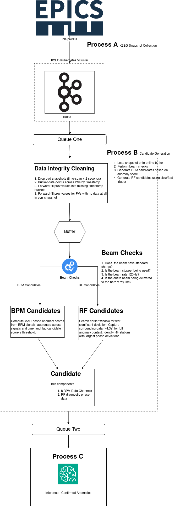
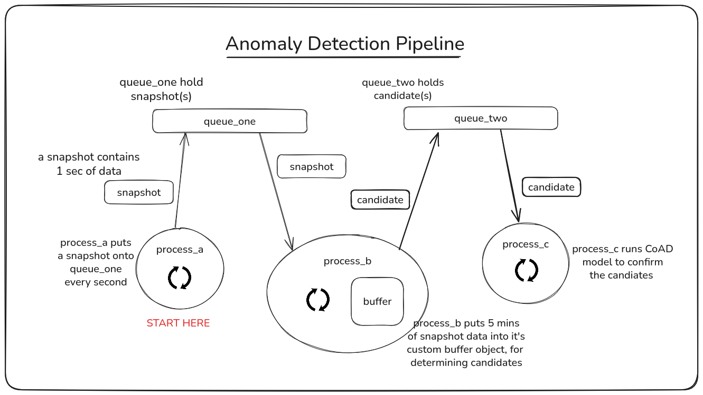

# RF Phase Anomaly Detection

For now, these docs just show some diagrams produced by the team..

This diagram describes in detail the steps taken in Process B to generate candidates.

(credit: https://github.com/bhardwaj-gopika)

This diagram shows at a high-level how to data flows between the processes and the shared buffers.

(credit: https://github.com/nstelter-slac)
