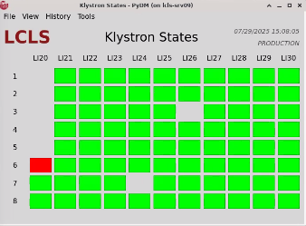

# RF Phase Anomaly Detection


## Overview:

This repo holds the backend code for RF anomaly detection using Jason's algorithm paper <https://arxiv.org/abs/2505.16052>.

Note that our implementation differs from the original paper in that it acts on live data from PVs, whereas the original paper's code uses historical PV data. This requirement for working on live data is what shaped most of the new design in this repo.

At a high level, this codebase implements a data-pipeline composed of 3 python processes.
We refer to these as processes as **Process a**, **Process b** and **Process c**.

**Process a** *(k2eg process)*: handles sending k2eg snapshots process_b  
**Process b** *(data handling process)*: cleans and formats data, and generates anomaly candidates  
**Process c** *(ml process)*: runs CoAD machine-learning model to confirm candidates

These processes send data down the pipeline (to the next process) using shared queue objects.

This diagram illustrates the flow of data between the 3 processes using the shared queues:
  
(credit: https://github.com/nstelter-slac)

We also provide a GUI that displays the detected anomalies.
To display this info, the GUI simply reads from the `KLYS:SYS0:1:ANOM_STATES` PVs, which our pipeline writes its results to.
This is so the GUI has no dependencies on the data-pipeline code and can live in a separate repo <https://github.com/slaclab/klys_mailbox_example>.

We will describe each process and the GUI in more detail below:


## Process A ("k2eg process")

To retrieve PV data, we utilize the K2EG library: <https://github.com/slaclab/k2eg-python>

"K2EG (Kafka to EPICS Gateway) is a scalable, high-performance gateway that bridges EPICS (Experimental Physics and Industrial Control System) process variables (PVs) with modern data streaming platforms using Apache Kafka.


The K2EG Python Library provides a simple, high-level API for interacting with the K2EG gateway, allowing users to perform operations such as reading and writing PVs, monitoring real-time updates, and managing snapshots of PV states, all through Kafka-backed messaging."

K2EG sends data in the form of a snapshot, which provides Process B with real-time data for all the PVs listed in `resources/pv_list.txt`.


## Process B ("data handling process")

This diagram describes in more detail the steps taken in Process B.


  
(credit: https://github.com/bhardwaj-gopika)

First, this process takes the snapshot data it receives and applies fixes for some known data-integrity issues, and then buckets the data based on expected time-stamp (see [buffer/snapshot_fixer.py](../buffer/snapshot_fixer.py)).

Then we put the data into our buffer object. For this process, we created a custom buffer object (see [buffer/buffer.py](../buffer/buffer.py)) containing our SlidingWindowArray (see [buffer/sliding_window.py](../buffer/sliding_window.py)) objects for each PV. The buffer and custom array objects allow for storing a rolling 5 mins of snapshot data in an efficent way. The data in the buffer is what then gets used for the beam checks and determining candidates.


After data is processed and put into the buffer, Process B also implements the beam and BSA quality checks from **Appendix C (page 11)** of: <https://journals.aps.org/prab/pdf/10.1103/PhysRevAccelBeams.25.122804>.

We also implement the Candidate Generation step from **Section IV Method A (Anomaly Candidate Generation pg.4)** and **Appendix C (pg 13) Candidate Selection** of <https://arxiv.org/abs/2505.16052>.

We describe these checks and candidate generation more clearly in the steps listed below:

### Beam Checks

1. Is the beam rate 120 Hz? We require IOC∶BSY0∶MP01∶PCRATE == 8.
2. Is the entire beam being delivered to the hard x-ray line? We require IOC∶IN20∶EV01∶RG02ACTRATE == 10.
3. Is the beam stopper being used? We require STPR∶BSYH∶2∶STD2INA == 0, indicating the beam stopper is out.
4. Does the beam have a standard charge at the injector? We require BPMS∶IN20∶221∶TMITCUH > 0.5 × 10**9.
A lower charge or the charge not being logged can indicate the beam is not being operated in a standard operational mode.

In the future, we do allow temporary (<90 s) violations of these conditions to not disallow short periods of “nonstandard” beam operation caused by automatic feedback or protection-based control mechanisms.


### Candidate Generation

1. Calculate BPM score 1 <- 1 timestamp (aggregate over the 8 BPM )
2. Calculate BPM score 20 <- rolling window is 20,  is aggregate over 20 time points of bpm_score_1 (step 1)
3. Locate slow triggers and these go to Candidate Anomaly Class object (I will have a bucket of these since buffer is constantly streaming data)
4. Wait till Buffer indicates that it has data that is 5 seconds in advance of the slow trigger in the  Candidate Anomaly Class object
5. Package data and send to Process C in the following format:
```
{
    "anomaly_timestamp": fast_time,
    "rf_input": rf_input.reshape(1, -1),
    "bpm_input": np.vstack(bpm_input),
    "rf_pv_name": most_anomalous_rf_pv_name,
    "anomaly_score": deviation_score,
    "system_level_anomaly": system_level_anom,
    "number_of_bad_datapoints": sum(data_quality_array),
}
```


## Process C ("ml process")


Process C receives candidate anomalies from Process B and uses the trained ML model from the original paper to confirm anomalies in the RF stations.

For more info, please see the [inference notes](inference.md).


## GUI

We provide a PyDM based GUI with a mailbox layout for the 81 RF stations. The mailbox lights up red for an anomalous RF station and stays green otherwise.

Code for the GUI is found in a separate repo: <https://github.com/slaclab/klys_mailbox_example>.


